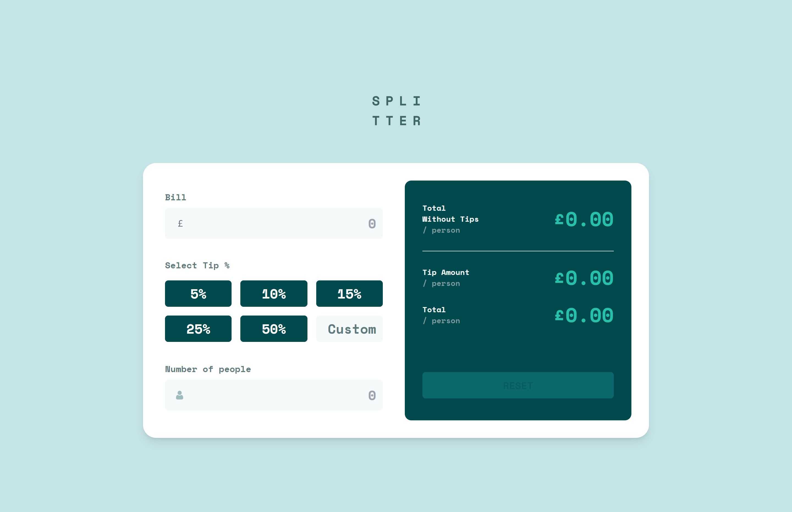

# Hi Everyone!👋

A fully responsive tip calculator app perfect to quickly check a bill including tips for one or more people. Very enjoyable project to code, I learnt quite a few things regarding validation, usage of radio buttons and a good practice for styling conditionally!

- Check out the link for this project: [https://jcasia-tip-calculator.netlify.app/](https://jcasia-tip-calculator.netlify.app/)

### I built this project using:

- React with TypeScript
- Tailwind CSS

### Here are some screenshots of the project:

